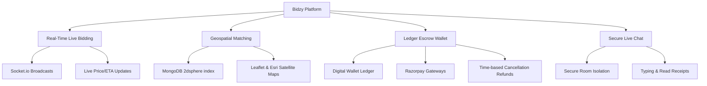
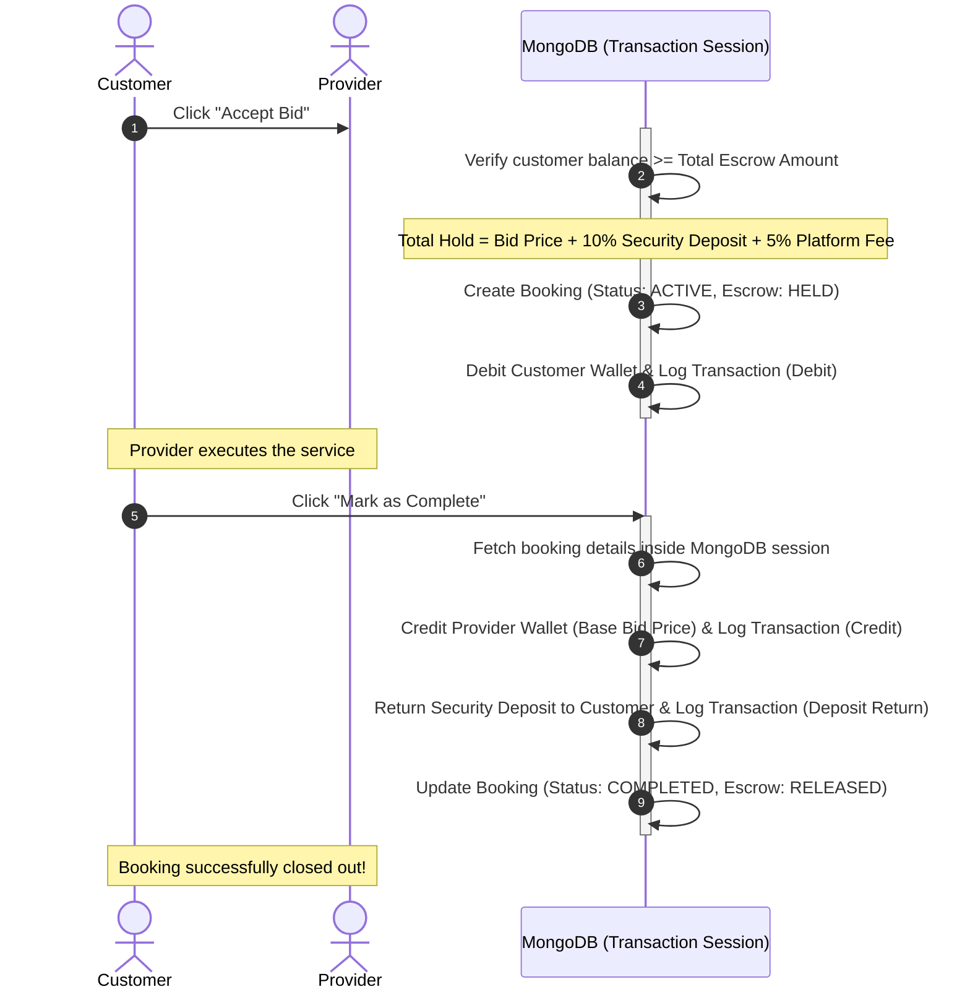

# Bidzy — Real-Time Service Bidding Marketplace

[](https://github.com/shiva/Bidzy)
[](#-technology-stack)
[](#-socketio-event-architecture)
[](#-wallet--escrow-ledger-system)

Bidzy is a hyper-local, real-time marketplace that connects customers with local service providers (electricians, plumbers, cleaners, etc.). Instead of facing rigid fixed pricing, customers post their service requests with location tags and watch nearby verified professionals engage in a live bidding war. 

Built with a secure double-ledger **Wallet & Escrow** payment workflow, Bidzy protects both parties during the contract cycle and provides real-time chat, geospatial distance querying, and automated cancellation/refund policies.

---

## 🌟 Key Pillars & Features



### ⚡ Real-Time Live Bidding (Socket.io)
* **Instant Bid Syncing**: Customers publish jobs and observe incoming bids with live pricing and ETA changes in real-time.
* **Proximity Feeds**: Providers receive immediate broadcast notifications when a new job is created within their active geographic radius.
* **Auto-Redirection**: Accepting a bid automatically establishes rooms and bridges both clients directly to their active booking detail pages.

### 📍 Hyper-Local Geospatial Engine
* **2dsphere Matching**: Jobs are indexed geographically using MongoDB's `$near` operator coordinates (`[longitude, latitude]`).
* **Pinpoint Location Picking**: Built-in Leaflet Map integrates with Esri World Imagery, letting customers drag and drop precise pins for home visits.

### 💳 Secure Escrow & Wallet System
* **Pre-Funded Escrow Hold**: Accepting a bid debits the customer's wallet for the **Total Escrow Amount** (Bid Price + 10% Security Deposit + 5% Platform Fee).
* **Double-Ledger Accountability**: All fund changes write immutable records to the `transactions` ledger.
* **Release Trigger**: Funds are held in escrow and only transferred to the provider when the customer explicitly marks the work as **Completed**.
* **Auto-Refund Policy**: If a customer cancels a booking, a time-based refund calculation is run:
  * Cancelled in $\le$ 15 minutes: **100% refund** of all held amounts.
  * Cancelled in 15–30 minutes: **50% base refund** (security deposit returned, provider receives half the base price).
  * Cancelled after 30 minutes: **0% base refund** (security deposit returned, provider receives full base price).
  * Provider cancellation always yields **100% refund** to the customer.

### 💬 Booking-Isolated Live Chat
* **Encrypted Rooms**: Chat rooms are locked to authorized booking parties (involved customer and provider) and admins.
* **Context Preservation**: Communication is archived upon completion or cancellation to ensure a historical record for dispute mitigation.

---

## 🏗️ Technology Stack

| Layer | Technologies & Libraries |
| :--- | :--- |
| **Frontend** | React 18, Vite, React Router DOM v6, Tailwind CSS, Zustand, Socket.io Client, Leaflet, Lucide Icons |
| **Backend** | Node.js (ESM), Express.js, Socket.io, Mongoose ODM, Passport.js (Google OAuth 2.0) |
| **Database** | MongoDB Atlas (utilizing Geospatial `2dsphere` indices) |
| **Integrations** | Razorpay (Payments & Orders), Cloudinary (Image uploads & KYC files) |

---

## 📁 Repository Directory Structure

```text
Bidzy/
├── backend/
│   ├── src/
│   │   ├── config/          # DB connections, constants, Razorpay & Cloudinary drivers
│   │   ├── controllers/     # MVC controller routers (auth, jobs, bids, bookings, wallets)
│   │   ├── middleware/      # JWT verification, Role access control, Error handlers
│   │   ├── models/          # MongoDB schemas (User, Job, Bid, Booking, Transaction, Chat)
│   │   ├── routes/          # Express route boundaries
│   │   ├── services/        # Wallet logic, Escrow handlers, Refund algorithms
│   │   ├── sockets/         # Socket.io lifecycle managers (chat & bidding)
│   │   ├── utils/           # Standardized API response and JWT utilities
│   │   └── server.js        # Main entrypoint initializing HTTP, Websockets, and DB
│   └── .env.example
└── frontend/
    ├── src/
    │   ├── components/      # UI widgets (Navbar, Spinner, Map Pickers, Bid Cards)
    │   ├── features/        # Business logic hooks (useBids, useAuth, useJobs)
    │   ├── layouts/         # Shared Shell views (CustomerLayout, ProviderLayout)
    │   ├── pages/           # Page roots (Bidding centers, Dashboards, Wallets, Booking Detail)
    │   ├── services/        # Axios API boundary connectors
    │   ├── store/           # Zustand centralized stores (Auth, Bookings, Chats)
    │   └── main.jsx         # Vite bootstrapping
```

---

## 💳 Wallet & Escrow Ledger System

When a customer accepts a bid, funds flow through isolated stages using transactions to guarantee integrity:



---

## 🔌 API Boundary Catalog

### Authentication
* `POST /api/auth/customer/register` — Register a customer profile.
* `POST /api/auth/customer/login` — Login as a customer.
* `POST /api/auth/provider/register` — Register a provider profile.
* `POST /api/auth/provider/login` — Login as a provider.
* `GET /api/auth/me` — Retrieve active profile details from JWT.

### Jobs & Geospatial Match
* `POST /api/jobs` — Create a new job post (requires `service`, `description`, `budget`, `urgency`, and `location` mapping).
* `GET /api/jobs` — Retrieve open jobs within active proximity (accepts `lng`, `lat`, and `maxDistance`).
* `GET /api/jobs/customer/my` — Get all jobs posted by the active customer.

### Bids & Bidding
* `POST /api/bids` — Submit a bid on a job (Provider only).
* `GET /api/bids/job/:jobId` — Get all bids submitted for a specific job.
* `POST /api/bids/:id/accept` — Accept a bid (Customer only; triggers Escrow Hold).
* `POST /api/bids/:id/reject` — Reject a bid.

### Bookings & Escrow
* `GET /api/bookings/customer/my` — Retrieve bookings for the active customer.
* `GET /api/bookings/provider/my` — Retrieve bookings for the active provider.
* `GET /api/bookings/:id` — Get full booking details with job, bid, customer, and provider records.
* `POST /api/bookings/:id/complete` — Mark booking as completed (Customer only; releases escrow).
* `POST /api/bookings/:id/cancel` — Cancel booking (Triggers partial or full refund based on timeline rules).

### Digital Wallet
* `GET /api/wallet` — Retrieve active wallet balance and transaction ledger list.
* `POST /api/wallet/add-funds` — Initialize a Razorpay deposit order.
* `POST /api/wallet/verify-payment` — Verify Razorpay signatures and credit wallet.

---

## ⚡ Socket.io Event Architecture

Live updates use isolated rooms to prevent performance degrade:

| Event Name | Direction | Payload | Description |
| :--- | :--- | :--- | :--- |
| `room:join` | Client $\rightarrow$ Server | `{ jobId }` or `{ bookingId }` | Joins a room to scope updates. |
| `room:leave` | Client $\rightarrow$ Server | `{ jobId }` or `{ bookingId }` | Leaves a room to clean up active listeners. |
| `bid:submitted` | Server $\rightarrow$ Client | `Bid` object | Broadcasts a new provider bid to the job room. |
| `bid:accepted` | Server $\rightarrow$ Client | `{ jobId, bidId, bookingId }` | Emitted when a bid is accepted; triggers client redirects. |
| `chat:message` | Bidirectional | `{ bookingId, message }` | Transmits chat messages between booking counterparties. |
| `chat:typing` | Bidirectional | `{ bookingId, isTyping }` | Informs counterparties of current active typing status. |

---

## 🚀 Local Installation & Setup

### 1. Prerequisites
Ensure you have the following installed on your developer machine:
* **Node.js** (v16.x or higher)
* **MongoDB** (installed locally or an active MongoDB Atlas cluster URI)

### 2. Project Clone
```bash
git clone https://github.com/your-username/Bidzy.git
cd Bidzy
```

### 3. Backend Setup
1. Open the backend folder and install the dependencies:
   ```bash
   cd backend
   npm install
   ```
2. Create a `.env` file in the `backend/` root directory:
   ```env
   PORT=5000
   MONGO_URI=mongodb://localhost:27017/bidzy
   JWT_SECRET=your_jwt_secret_token
   JWT_EXPIRES_IN=30d
   CLIENT_URL=http://localhost:5173

   # Razorpay API Credentials (Test Keys)
   RAZORPAY_KEY_ID=rzp_test_yourKeyId
   RAZORPAY_KEY_SECRET=yourKeySecret

   # Cloudinary Storage Configuration
   CLOUDINARY_CLOUD_NAME=yourCloudName
   CLOUDINARY_API_KEY=yourApiKey
   CLOUDINARY_API_SECRET=yourApiSecret
   ```
3. Run the backend server in development mode:
   ```bash
   npm run dev
   ```
   *The server will boot and connect to MongoDB on `http://localhost:5000`.*

### 4. Frontend Setup
1. Open the frontend folder and install the dependencies:
   ```bash
   cd ../frontend
   npm install
   ```
2. Start the Vite React development server:
   ```bash
   npm run dev
   ```
3. Open your browser and navigate to `http://localhost:5173`.

---

## 🛠️ Testing & Mock Options

### Local Mock Testing (Without External Services)
To allow testing without setting up full Cloudinary credentials or Google Developer keys:
* **Google OAuth Mocking**: If Google credentials are not supplied, the interface automatically presents a Developer Quick login bypass allowing role toggles (Customer / Provider) to test the app instantly.
* **Razorpay Test Cards**: When adding funds to the wallet in development, Razorpay sandbox is active. Use **Netbanking** (Choose HDFC/SBI and click successful checkout) or use a domestic Indian test card number:
  * **Card Number**: `5081 2611 1111 1111`
  * **CVV**: `123`
  * **Expiry**: Any future date (e.g. `12/30`)

### Seeding Default Administrators
Admin credentials are automatically generated upon database connection if no admin exists.
* **Admin Email**: `admin@bidzy.com`
* **Admin Password**: `Admin@12345`

---

## 🛡️ License
[MIT](./LICENSE)
